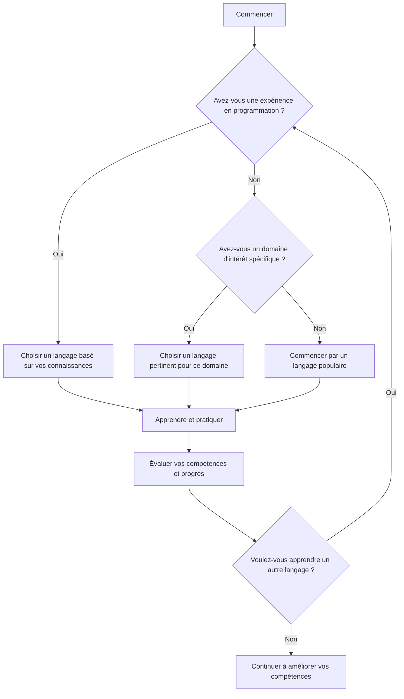

```mermaid
flowchart TD
    A[Commencer] --> B{Avez-vous une expérience en programmation ?}
    B -- Oui --> C[Choisir un langage basé sur vos connaissances]
    B -- Non --> D{Avez-vous un domaine d'intérêt spécifique ?}
    D -- Oui --> E[Choisir un langage pertinent pour ce domaine]
    D -- Non --> F[Commencer par un langage populaire]
    C --> G[Apprendre et pratiquer]
    E --> G[Apprendre et pratiquer]
    F --> G[Apprendre et pratiquer]
    G --> H[Évaluer vos compétences et progrès]
    H --> I{Voulez-vous apprendre un autre langage ?}
    I -- Oui --> B
    I -- Non --> J[Continuer à améliorer vos compétences]
```
