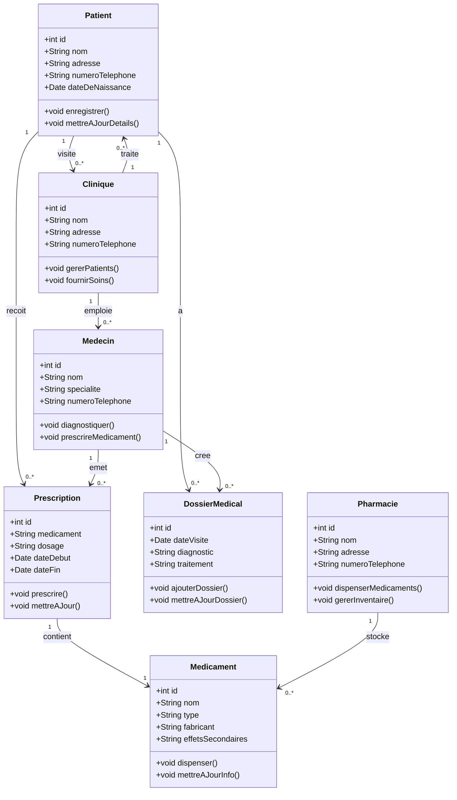

```mermaid
classDiagram
    class Patient {
        +int id
        +String nom
        +String adresse
        +String numeroTelephone
        +Date dateDeNaissance
        +void enregistrer()
        +void mettreAJourDetails()
    }

    class Prescription {
        +int id
        +String medicament
        +String dosage
        +Date dateDebut
        +Date dateFin
        +void prescrire()
        +void mettreAJour()
    }

    class DossierMedical {
        +int id
        +Date dateVisite
        +String diagnostic
        +String traitement
        +void ajouterDossier()
        +void mettreAJourDossier()
    }

    class Medicament {
        +int id
        +String nom
        +String type
        +String fabricant
        +String effetsSecondaires
        +void dispenser()
        +void mettreAJourInfo()
    }

    class Pharmacie {
        +int id
        +String nom
        +String adresse
        +String numeroTelephone
        +void dispenserMedicaments()
        +void gererInventaire()
    }

    class Medecin {
        +int id
        +String nom
        +String specialite
        +String numeroTelephone
        +void diagnostiquer()
        +void prescrireMedicament()
    }

    class Clinique {
        +int id
        +String nom
        +String adresse
        +String numeroTelephone
        +void gererPatients()
        +void fournirSoins()
    }

    Patient "1" --> "0..*" Prescription : recoit
    Patient "1" --> "0..*" DossierMedical : a
    Prescription "1" --> "1" Medicament : contient
    Pharmacie "1" --> "0..*" Medicament : stocke
    Medecin "1" --> "0..*" Prescription : emet
    Medecin "1" --> "0..*" DossierMedical : cree
    Clinique "1" --> "0..*" Medecin : emploie
    Clinique "1" --> "0..*" Patient : traite
    Patient "1" --> "0..*" Clinique : visite
```

```
